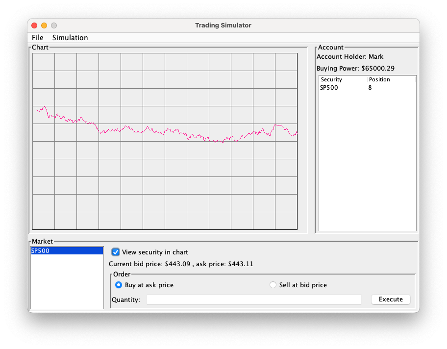

# Trading Simulator

## Introduction

The ETF Timing Simulator is a robust Java desktop application designed to empower users in simulating timing their financial investments with ease. In an ever-evolving financial landscape, having a tool that provides education and an opportunity to try timing the market without real life consequences is invaluable.

Students seeking an understanding of day trading in the stock market are the intended users for this project,

I started this project because I want to demonstrate that if stock prices are a random walk, it is not possible to beat the average consistently.

## User Stories

### 1. View Account
- *As a user*, I want to be able to **view my balance and positions**, *so that* I can have a clear overview of my current financial standing.

### 2. Get Quotes for Existing Securities
- *As a user*, I want to be able to **get quote for existing securities**, *so that* know the exact buy and sell price.

### 3. View Security History
- *As a user*, I want to be able to **view the market history**, including past prices, *so that* I can track the market over time and make informed decisions.

### 4. Buy or Sell Securities
- *As a user*, I want to be able to **buy or sell stocks or securities**, *so that* I can simulate simple market timing strategies optimize my portfolio.

### 5. Add New Securities
- *As a user*, I want to be able to **add new simulated securities**, *so that* I can simulate diversifying my portfolio.

### 6. List Existing Securities
- *As a user*, I want to be able to **view existing securities**, *so that* I can remember which ETFs are being simulated.

### 7. Save Simulation
- *As a user*, I want to be able to **save the simulation**, *so that* I continue the simulation at a later date if I so choose.

### 8. Load Simulation
- *As a user*, I want to be able to **load the simulation**, *so that* I continue with simulation if I choose so.

## Instructions for Grader
- You can generate the first required action related to adding Security to an Account by using menu "Simulation > Create New Security" or Ctrl + X. Input in the dialog box must be valid string for ticker, and doubles for rest.
- You can generate the second required action related to trading Security with Account by using Order JPanel. Select desired security in market JList, select desired radiobutton action, enter a valid integer to Quantity field and click Execute button.
- You can locate my visual component by looking at the chart JPanel. You must select desired security in market JList and click view security in chart checkbox.
- You can save the state of this application by using menu "File > Save File" or Ctrl + S.
- You can reload the state of this application by using menu "File > Load File" or Ctrl + O.
- You can create new account by using menu "File > New Account" or Ctrl + N. Input must be valid String and double.

## Phase 4: Task 2
Representative sample of the events that occur when your program runs:

Sun Nov 26 16:42:13 PST 2023\
Account@367746789: Account loaded: [ name: Mark, cash: $1989.29, SP500 position: 5, BRK position: 5, QQQ position: 10 ]\
Sun Nov 26 16:42:20 PST 2023\
Account@367746789: Sold security: SP500 QTY4 at $6010.78\
Sun Nov 26 16:43:10 PST 2023\
Account@367746789: Sold security: BRK QTY5 at $21553.82\
Sun Nov 26 16:43:47 PST 2023\
Account@367746789: Sold security: QQQ QTY9 at $5908.41\
Sun Nov 26 16:43:59 PST 2023\
Account@367746789: Failed to buy: QQQ QTY200 at $5905.97\
Sun Nov 26 16:44:03 PST 2023\
Account@367746789: Bought security: QQQ QTY20 at $5905.97

## Phase 4: Task 3
- Currently, to generate price history we check the elapsed time on each price request and generate history depending on how much time passed. This is OK for the CLI, but it is not great for the GUI since we could request a price through a user action and there is a request for update each 5 seconds. Technically both user and the 5-second update could request an update at the same time, and we could generate the same history twice. This would need to be mitigated with a lock or we can use Observer pattern to update price in GUI.
- Price generation is better done through a manager class rather than user requests. A SecurityManager class would be a better option to store the list of securities, as this would allow each security to be updated at the same time rather than each security watching time passed on their own.
- A SecurityManager class would also allow using same securities for multiple accounts.
- Poor decoupling for Account and Security classes. Currently, the quantity of each security is a field in security but this data is more associated with the account. I took shortcuts because I knew the requirements but this would not be a good long term solution if we wanted to add multiple accounts in the future.
- JsonWriter and JsonReader could be singletons because we do not need more than 1 instance of these classes.
- MarketListCellRenderer can be removed completely if we implement .toString() method in model::Security. I was lazy on phase 3 and didn't want to create new tests.
- Existence of GuiState is basically antithesis of decoupling. I just wanted to organize these fields in TradingSimulatorGUI class, but I should not have created an instantiable GuiState class for this. Instead, maybe a private nested struct could have been better.